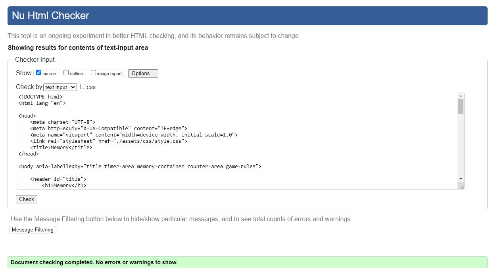

# Memory
This memory game is a perfect game to challenge the user's memory with. Each time they reset it, the colors will change location. When ready the user can press the start button and see the timer start ticking! In essence, it's go time! 

This creates the perfect challenge for the user to not only see how fast they can complete the game but also with the fewest possible clicks. It is aimed at all ages as it is simple to use and play with!

## Features
- The Memory Heading
  - Featured at the top of the page is the name of the game! Easy to see and understand what the game is about.

- The Game Area Top
    - Here the user can start the game by pushing the start button.

    - When hovering over the button it will change style and color, showing the user that it can be interacted with.

    - Once they click on the start button, the timer will start counting. The game has begun!
    - Once the game begins the start button will disappear until the reset button further down is clicked on. The cards will appear in the center of the game board indicating to the player that the game is now playable.

- The Game Area Middle
    - Here the player will see several cards which all look the same.

    - When hovering over them they will be highlighted with a red border similar to the start button. Indicating to the player that it can be clicked.

    
    - Once the player clicks on the card, the card will flip. Revealing the color it holds. It will remain there until the user clicks on another card. If it is not a match then it will revert to its default state.

    - If it is a match then the cards will remain visible and a point will be added to the lower part of the game board.

- The Game Area Bottom
    - On the left side it shows the number of clicks the player has done while playing the game.
    - On the right side it shows the number of pairs the player currently has.

    - In the middle, there is a reset button which will highlight similar to the start button when hovering. Indicating to the player that it can be clicked.

    - Once clicked the game will reset to its original state.

- Footer
    - Here the player can quickly read about the rules of the game and how to start. 
    - It is easy to read and understand for all age groups thereby avoiding confusion.

## Features Left to Implement
- Add an overlay when all cards are matched, congratulating the player.
- Add an input field where the player can register a name that will be saved to a high scoreboard.
- Add a high scoreboard, showing the name of the player, the speed, and the number of clicks they used. Ranking the fastest and most accurate one, top to bottom.
- Add more levels which increase the number of cards. Thereby increasing the difficulty.

## Testing
- I have tested the site using google chrome dev tools - mobile view. I have clicked on each tab at the top to see what it looks like in various screen sizes.
- I have also used [Am I Responsive](https://ui.dev/amiresponsive) to make sure it works as it should.
- I have tested the game multiple times to make sure all functions are working accurately while also having the dev tools open and watching the console section for any errors.
- I have also tested the live site on my android phone.

### Validator Testing
- HTML
    - When first testing I encountered several small errors which have been fixed.

    - It has now passed [W3C Validator](https://validator.w3.org/nu/#textarea)

- CSS
    - No errors were found when passing the [Jigsaw Validator](https://jigsaw.w3.org/css-validator/validator)

- JavaScript
    - Several minor errors were found when first checking with [Jshint Validator](https://jshint.com/).

    - I have now fixed most of them. Only two warnings remain but I don't think they are necessary to address.

    - The following metrics were returned:
    - There are 13 functions in this file.
    - Function with the largest signature takes 0 arguments, while the median is 0.
    - Largest function has 10 statements in it, while the median is 4.
    - The most complex function has a cyclomatic complexity value of 3 while the median is 1.

- Lighthouse
    - The website passed the lighthouse tests without fail. 

### Unfixed Bugs
There are no bugs that I am aware of. There was a quirk I noticed about the setInterval feature to increment the time, if clicked multiple times it would add together implementing with an additional 1 each second. I tried using the clearInterval to fix it as shown in the guides I followed but they never addressed it in their tutorial so I am not sure if there is an inherent error in their code. 

I have chosen to hide the start button once clicked upon to avoid the user getting this problem. 
The guides I used to set the timer and interval are the following.
- [Youtube - dcode](https://www.youtube.com/watch?v=ubLC1JxMqfY)
- [Tutorial Republic](https://www.tutorialrepublic.com/faq/how-to-stop-setinterval-call-in-javascript.php)

## Deployment
- The site was deployed using GitHub pages. The steps to deploy are the following.
    - In the GitHub repository, navigate to the settings tab
    - On the left side there is a button called "Pages", click on it and it will open up GitHub Pages to the right.
    - Click on the "None" button and chose the main branch.
    - Click on the "Save" button and the site will be deployed.

here is a live link to this site [Memory](https://julius-88.github.io/memory/)

## Credits

### Content
 - Instructions on how to create a flippable card were taken from [w3schools](https://www.w3schools.com/howto/howto_css_flip_card.asp)
 - Instructions on how to implement the Interval method and how to stop it was taken from these two sources:
    - [Youtube - dcode](https://www.youtube.com/watch?v=ubLC1JxMqfY)
    - [Tutorial Republic](https://www.tutorialrepublic.com/faq/how-to-stop-setinterval-call-in-javascript.php)
- Instructions on how to create a shuffle function for the cards were taken from:
    - [Youtube - All Things JavaScript, LLC](https://www.youtube.com/watch?v=myL4xmtAVtw)
- I also used these sites to figure out how to append the shuffle function.
    - [w3schools](https://www.w3schools.com/js/js_htmldom_nodelist.asp)
    - [w3schools](https://www.w3schools.com/jsref/met_node_appendchild.asp)
- I used this site to choose my color palette.  
    - [coolors](https://coolors.co/palette/0d1321-1d2d44-3e5c76-748cab-f0ebd8)
- Adding a comment on top of the js file to avoid const warnings in the jshint validator was taken from: 
    - [stackoverflow](https://stackoverflow.com/questions/27441803/why-does-jshint-throw-a-warning-if-i-am-using-const)
